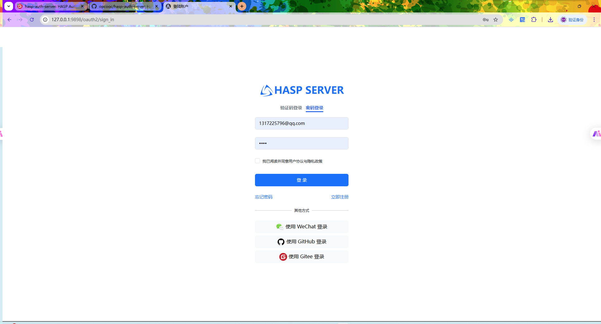
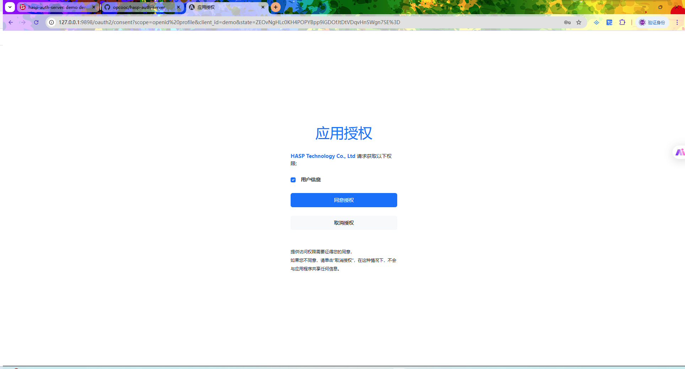
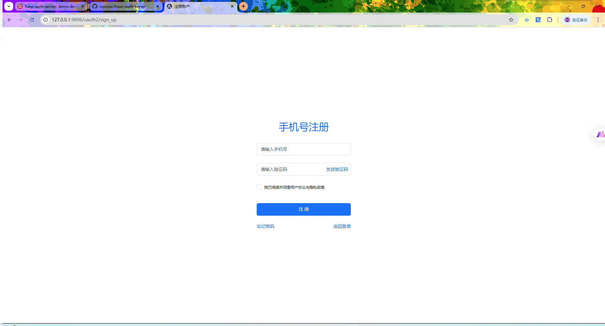

# HASP Auth Server

## 📚 目录
- [项目简介](#项目简介)
- [技术选型](#技术选型)
- [功能概览](#功能概览)
- [模块划分](#模块划分)
- [接口文档](#接口文档)
    - [授权请求 (Authorize Request)](#authorize-request)
    - [获取 Token (Get Token)](#get-token)
    - [撤销 Token (Revoke Token)](#revoke-token)
    - [设备授权请求 (Device Authorization Request)](#device-authorization-request)
    - [设备验证请求 (Device Verification Request)](#device-verification-request)
    - [Token 信息查询 (Token Introspection)](#token-introspection)
    - [获取 JWK 集合 (Get JWK Set)](#get-jwk-set)
- [外部用户服务集成说明](#外部用户服务集成说明)
- [部署方式](#部署方式)
- [使用示例](#使用示例)
- [注意事项](#注意事项)
- [版本信息](#版本信息)

---

## 项目简介

HASP Auth Server 是一个基于 Spring Authorization Server 的认证授权服务，支持标准 OAuth2 流程和 JWT 签发，用户信息、客户端信息通过外部 HTTP 服务动态获取，适用于中大型分布式系统的统一认证场景。
 
swagger-ui: `http://127.0.0.1:9898/swagger-ui/index.html`
 
授权URL: `http://127.0.0.1:9898/oauth2/authorize?response_type=code&scope=profile%20openid&client_id=demo&redirect_uri=http://127.0.0.1:9527/home&state=8a0781548e7f76ae018e94e450982413`
## 项目截图

  

 

  

 

  

 

  

 

  

---

## 技术选型

- Java 21+
- Spring Boot 3.x
- Spring Authorization Server
- Spring Security 6.x
- JWT（JSON Web Token）
- Redis
- Lombok

---

## 功能概览

- 用户认证与授权
- OAuth2 授权码模式
- JWT 生成与验证
- 支持外部用户服务集成
- Token 自动刷新机制
- 定时轮换本地密钥文件
---

## 模块划分

- 认证模块：登录、登出、刷新 Token
- 用户模块：通过外部 HTTP 获取用户信息

---

## 接口文档
## OAuth2 相关接口

---

## 授权请求 (Authorize Request)
- **URI**: `/oauth2/authorize`
- **方法**: `GET`
- **说明**: 客户端应用程序向该端点请求授权，用户通过该端点进行认证。

#### 请求参数
| 参数              | 类型   | 描述                             |
|-------------------|--------|----------------------------------|
| `response_type`   | string | 授权类型（例如 `code`）           |
| `client_id`       | string | 客户端 ID                        |
| `redirect_uri`    | string | 授权完成后重定向的 URI            |
| `scope`           | string | 请求的权限范围                    |
| `state`           | string | 防止 CSRF 攻击的随机字符串         |

#### 返回参数
- **成功时**: 重定向到 `redirect_uri`，并附带授权码 `code`。
- **失败时**: 返回错误码 `error` 和描述。

---

## 设备授权请求 (Device Authorization Request)
- **URI**: `/oauth2/device_authorization`
- **方法**: `POST`
- **说明**: 用于设备认证流，设备通过该端点请求一个设备授权码。

#### 请求参数
| 参数                | 类型   | 描述                             |
|---------------------|--------|----------------------------------|
| `client_id`         | string | 客户端 ID                        |
| `scope`             | string | 请求的权限范围                    |

#### 返回参数
| 参数                 | 类型   | 描述                             |
|----------------------|--------|----------------------------------|
| `device_code`        | string | 设备授权码                        |
| `user_code`          | string | 用户授权码，用于用户验证操作      |
| `verification_uri`   | string | 用户输入授权码的验证页面 URL      |
| `expires_in`         | int    | 授权码的有效期（秒）               |

---

## 设备验证请求 (Device Verification Request)
- **URI**: `/oauth2/device_verification`
- **方法**: `GET`
- **说明**: 设备通过该端点进行验证，用户在其他设备上输入授权码。

#### 请求参数
| 参数             | 类型   | 描述                              |
|------------------|--------|-----------------------------------|
| `user_code`      | string | 用户授权码，用户在其他设备上输入   |

#### 返回参数
| 参数             | 类型   | 描述                              |
|------------------|--------|-----------------------------------|
| `device_code`    | string | 设备授权码                        |
| `status`         | string | 验证状态（例如 `pending` 或 `accepted`） |

---

## 获取 Token (Get Token)
- **URI**: `/oauth2/token`
- **方法**: `POST`
- **说明**: 用于请求访问令牌，通常在授权码模式、密码模式和客户端凭证模式中使用。

#### 请求参数
| 参数             | 类型   | 描述                              |
|------------------|--------|-----------------------------------|
| `grant_type`     | string | 授权类型（例如 `authorization_code`）|
| `code`           | string | 授权码（如果是授权码模式）         |
| `redirect_uri`   | string | 授权成功后重定向的 URI            |
| `client_id`      | string | 客户端 ID                        |
| `client_secret`  | string | 客户端密钥                        |

#### 返回参数
| 参数             | 类型   | 描述                              |
|------------------|--------|-----------------------------------|
| `access_token`   | string | 访问令牌                           |
| `token_type`     | string | 令牌类型（例如 `bearer`）           |
| `expires_in`     | int    | 访问令牌的有效期（秒）               |
| `refresh_token`  | string | 刷新令牌                           |

---

## 获取 JWK 集合 (Get JWK Set)
- **URI**: `/oauth2/jwks`
- **方法**: `GET`
- **说明**: 获取 JSON Web Key Set（JWK Set），用于验证 JWT 的签名。

#### 返回参数
| 参数            | 类型   | 描述                           |
|-----------------|--------|--------------------------------|
| `keys`          | array  | JWK 数组，每个 JWK 包含如下字段：|
| `kty`           | string | 密钥类型（例如 `RSA`）           |
| `alg`           | string | 签名算法（例如 `RS256`）         |
| `use`           | string | 密钥用途（例如 `sig`）           |
| `kid`           | string | 密钥 ID                         |
| `n`             | string | RSA 模数                         |
| `e`             | string | RSA 公钥指数                     |

---

## 撤销 Token (Revoke Token)
- **URI**: `/oauth2/revoke`
- **方法**: `POST`
- **说明**: 客户端可以通过该端点撤销一个有效的访问令牌或刷新令牌。

#### 请求参数
| 参数             | 类型   | 描述                             |
|------------------|--------|----------------------------------|
| `token`          | string | 要撤销的令牌                      |
| `token_type_hint`| string | 令牌类型提示（例如 `access_token` 或 `refresh_token`）|

#### 返回参数
- **成功时**: 返回 HTTP 状态码 200。
- **失败时**: 返回错误信息。

---

## Token 信息查询 (Token Introspection)
- **URI**: `/oauth2/introspect`
- **方法**: `POST`
- **说明**: 用于检查访问令牌的有效性，返回令牌的详细信息。

#### 请求参数
| 参数             | 类型   | 描述                             |
|------------------|--------|----------------------------------|
| `token`          | string | 需要检查的令牌                    |
| `token_type_hint`| string | 令牌类型提示（例如 `access_token`）|

#### 返回参数
| 参数             | 类型   | 描述                             |
|------------------|--------|----------------------------------|
| `active`         | boolean| 令牌是否有效                      |
| `client_id`      | string | 客户端 ID                        |
| `scope`          | string | 令牌的权限范围                    |
| `exp`            | int    | 令牌的过期时间（Unix 时间戳）      |
| `iat`            | int    | 令牌的签发时间（Unix 时间戳）      |

---